# AI Security Gateway

[](https://github.com/eugene-infosec/ai-security-gateway/actions/workflows/ci.yml)
[](https://github.com/eugene-infosec/ai-security-gateway/actions/workflows/codeql.yml)


**Retrieval-Safety-as-Code:** a production-shaped demo multi-tenant gateway that makes *unauthorized retrieval* hard by construction.

> **Quick Review:**
> * **30 Seconds:** Run `make review` → Guided summary of build status & gates.
> * **90 Seconds:** Run `make gate` → View [Evidence Index](evidence/INDEX.md).
> * **5 Minutes:** `make run-local` → Trigger a deny receipt → Inspect `app/security/policy.py`.

## ⚡ Verify in 90 Seconds
You can verify the entire Security Gateway contract (Auth, Latency, Tracing) using the included reference client.

1. **Start the Gateway:**
   ```bash
   make run-local
   ```

2. **Run the Compliance Check:**
   ```bash
   python examples/reference-client/verify.py
   ```

**Output:**

🚀 Verifying Security Gateway Invariants...

STATUS    | INVARIANT                 | LATENCY | TRACE_ID

---

✅ PASS   | Service Liveness          |  10ms | 6f3f0...

✅ PASS   | Identity Resolution       |   2ms | 16ac8...

✅ PASS   | Policy Enforcement (403)  |   2ms | 8ae9d...

---

✨ All Security Invariants Verified.

## 🛡️ Engineering Standards (v0.9.2)

This project enforces security invariants through **infrastructure-as-code** and **automated gates**.

| Standard          | Implementation                                                             | Evidence                                                     |
| :---              | :---                                                                       | :---                                                         |
| **Fail-Closed** | App refuses to start if `AUTH_MODE` is misconfigured.                      | [E09: Crash Proof](evidence/E09_fail_closed.png)             |
| **Observability** | Structured JSON logs for all security events.                              | [E07: JSON Logs](evidence/E07_jwt_attack_receipt_cloud.png)  |
| **Automation** | CI pipeline runs linters, tests, and security gates.                       | [E10: CI Pipeline](evidence/E10_ci_pipeline.png)             |
| **Zero Trust** | Identity derived strictly from JWT (Cognito), not headers.                 | [E06: JWT Identity](evidence/E06_jwt_whoami.png)             |
| **Supply Chain** | `pip-audit` runs on every commit; builds use vendored hashes.              | [E02: Gates Pass](evidence/E02_gate_pass_local.png)          |

---

## What this is

```mermaid
sequenceDiagram
    autonumber
    actor User as Client (Intern)
    participant GW as API Gateway (JWT)
    participant App as Security Gateway (Lambda)
    participant DB as Document Store

    Note over User, App: 🛑 ATTEMPT: Intern requests Admin Runbook

    User->>GW: POST /retrieve (JWT: role=intern)
    GW->>App: Invoke (Validated Claims)

    rect rgb(60, 20, 20)
        Note right of App: 🛡️ SECURITY BOUNDARY
        App->>App: Derive Principal
        App->>App: Evaluate Policy (Intern != Admin)
        App->>App: ❌ BLOCK (Fail-Closed)
    end

    Note over App, DB: 🔒 The DB is NEVER queried

    App-->>User: 403 Forbidden + Deny Receipt

```



## 🎬 See it in action (80s)

> **"Stop patching prompts. Start securing retrieval."**

[](evidence/demo.mp4)

*Click the image above to watch the full architecture and attack demo (with audio).*

A production-shaped **retrieval gateway** for RAG-style systems. The intended use case is simple and realistic:

> **Teams building “chat over docs / RAG features” must call this gateway for retrieval (and snippets) instead of querying the document store directly.**

This gateway enforces **Auth-Before-Retrieval** inside a strict trust boundary and emits structured **deny receipts** for every blocked action.

In RAG, the common critical leak is not “the LLM,” it’s **retrieval fetching the wrong tenant or wrong role**. Once unauthorized text enters the context window, you can’t “unfetch” it. This project prevents that failure mode by enforcing scope *before* storage reads and snippet generation.

### Concrete scenario (what it blocks)

* An **intern in Tenant A** tries to retrieve:
* an **admin-classified runbook**, or
* **Tenant B’s roadmap**


* Result: **blocked (403)** + **deny receipt** with `request_id` + `reason_code` (auditable, screenshot-safe).

### Why lexical search (intentional)

Retrieval is currently **deterministic lexical scoring** on purpose: the thesis is the **security boundary and invariants**, not embeddings quality. Vector search can be added later **without changing the invariants**.

---

## Non-negotiable security invariants

These invariants are enforced by code and continuously checked by `make gate`:

1. **No Admin Leakage**
Non-admin roles must never retrieve admin-classified content (titles/snippets/bodies).
2. **Strict Tenant Isolation**
Tenant A must never retrieve Tenant B data (structural scoping in storage keys + server-side authority).
3. **Safe Logging**
Logs must never contain raw request bodies/queries/auth headers/tokens.
4. **Evidence-over-Claims**
Every denial is traceable via `request_id` and backed by numbered evidence artifacts.
5. **No Secret Egress via Snippets**
Snippet output is redacted to prevent accidental secret leakage.

---

## Trust boundary

* **Untrusted inputs:** request headers/body, query text, stored document text, any client-supplied claims.
* **Trusted compute boundary:** principal derivation, policy evaluation, tenant scoping, snippet redaction, audit logging.

### Identity modes

* **Local dev:** deterministic header identity (`X-User`, `X-Tenant`, `X-Role`) for fast tests and demos.
* **Cloud dev:** **Cognito JWT authorizer at API Gateway**; Lambda derives `Principal` from verified claims.

---

## ⚡ Start here (2 minutes)

### 1) Run the proof harness (security gates)

```bash
make ci
# or: make gate

```

### Docker (optional reviewer shortcut)

If you prefer zero Python tooling on your machine & have Docker installed:

```bash
make docker-build
make docker-run
curl -i [http://127.0.0.1:8000/health](http://127.0.0.1:8000/health) -H 'X-Request-Id: demo-123'

```

If Docker is not installed, skip this - `make run-local` covers the full local demo.

### 2) Trigger a deny receipt (local)

```bash
make run-local

# In another terminal:
curl -i -X POST [http://127.0.0.1:8000/ingest](http://127.0.0.1:8000/ingest) \
  -H 'Content-Type: application/json' \
  -H 'X-User: malicious_intern' -H 'X-Tenant: tenant-a' -H 'X-Role: intern' \
  -d '{"title":"HACK","body":"x","classification":"admin"}'

```

Result: HTTP 403 and a structured audit log in stdout (deny receipt).

### 3) Verify proof (evidence artifacts)

All claims are backed by screenshots in `evidence/INDEX.md` (highlights below).

| ID | Proof Artifact | Claim |
| --- | --- | --- |
| **E01** | `E01_attack_receipt_local.png` | Local deny receipt with `request_id` |
| **E02** | `E02_gate_pass_local.png` | Security gates passing locally |
| **E04** | `E04_attack_receipt_cloud.png` | AWS CloudWatch deny receipt |
| **E06** | `E06_jwt_whoami.png` | JWT identity verification (`/whoami`) |
| **E08** | `E08_redaction_proof.png` | Snippet redaction (secret scrubbing) |

---

## 🗺️ Repo map

* `app/` - FastAPI app + Lambda handler
* `app/security/` - principal, policy, audit, JWT mapping, redaction engine
* `evals/` - security invariant regression harness (“security gates”)
* `infra/terraform/` - AWS dev slice (Lambda + HTTP API + Cognito + alarms)
* `docs/` - architecture, threat model, runbook, tradeoffs, decisions
* `evidence/` - numbered proof artifacts + index
* `tests/` - unit tests (incl. JWT principal + redaction)

---

## 🚀 Quick start (local)

**Prereqs:** Python 3.12+, `make`.

```bash
python3 -m venv .venv && source .venv/bin/activate
make install
make doctor
make run-local

```

Verify liveness + identity:

```bash
curl -s [http://127.0.0.1:8000/health](http://127.0.0.1:8000/health)
curl -s [http://127.0.0.1:8000/whoami](http://127.0.0.1:8000/whoami) \
  -H 'X-User: demo' -H 'X-Tenant: tenant-a' -H 'X-Role: intern'

```

---

## ☁️ Cloud dev slice (AWS + JWT)

**Prereqs:** AWS CLI configured, Terraform installed.

```bash
make doctor-aws
make deploy-dev

scripts/cognito_bootstrap_user.sh test-intern tenant-a intern
source scripts/auth.sh

make smoke-cloud
make logs-cloud

make destroy-dev

```

> In the cloud, `/health` is public. All other routes require a valid JWT via the API Gateway authorizer.

---

## 🎬 Demo framing (2-10 minutes)

This is the quickest “real system” story to tell:

1. **Use case:** “Our app must call this gateway for retrieval instead of hitting the store directly.”
2. **Threat:** “Intern in Tenant A tries to retrieve admin runbook / Tenant B roadmap.”
3. **Result:** “Blocked before retrieval; deny receipt emitted; CI gates prevent regressions.”

For the full walkthrough: `docs/demo.md`.

---

## 📚 Documentation (truth-scoped)

* Architecture: `docs/architecture.md`
* Threat model: `docs/threat_model.md`
* Tradeoffs: `docs/tradeoffs.md`
* Runbook: `docs/runbook.md`
* Costs: `COSTS.md`
* Decisions (ADRs): `docs/decisions/`

---

## 🧠 Key Architectural Decisions

I prioritized **security invariants** and **reviewer experience** over feature bloat.

### 1. Deterministic Lexical Search vs. Vector Search

* **Decision:** We use exact lexical matching (keyword/metadata) rather than vector embeddings for the security boundary.
* **Why:** Vector search is probabilistic; a security gate must be deterministic. We cannot risk an "89% semantic match" allowing a leak. The security layer enforces *scope*, leaving the semantic relevance to the underlying LLM application.

### 2. Regex-Based Redaction vs. NLP Named Entity Recognition

* **Decision:** Secrets (API keys, PII) are scrubbed using high-performance Regex patterns, not an ML model.
* **Why:** Latency and predictability. Running a secondary NLP model for redaction adds significant latency to the critical retrieval path and introduces non-deterministic failure modes.

### 3. Serverless Compute (AWS Lambda)

* **Decision:** The gateway runs on Lambda rather than containers (ECS/K8s).
* **Why:** Cost and isolation. The "scale-to-zero" cost model fits the intermittent nature of RAG retrieval calls. Furthermore, Lambda provides strong process isolation per request, minimizing the blast radius of a potential tenant context leak.

### 4. Native Wheel Vendoring vs. Docker

* **Decision:** We do not use Docker for builds. Instead, we use a custom script to vendor `manylinux2014_x86_64` wheels directly.
* **Why:** Reviewer Friction. Requiring Docker prevents many reviewers (especially on Mac/Windows) from easily deploying the cloud slice. This approach allows a reviewer to deploy to AWS from a fresh laptop in seconds with zero system dependencies beyond Python.

### 5. In-Memory Store (Demo) vs. Database

* **Decision:** The demo uses a strict `InMemoryStore` instead of connecting to a real database (DynamoDB/Pinecone).
* **Why:** Reproducibility. A "production-shaped" demo must work on the reviewer's machine immediately. Cloud credentials and database setup introduce friction that distracts from the security logic.

---

## 💰 Cost safety (dev)

Designed to be cheap-by-default:

* serverless (Lambda scale-to-zero)
* short log retention (7 days)
* alarms for 5xx / throttles / high denials
* explicit kill switch: `make destroy-dev`
