<div align="center">

# 🛡️ Compliance-Aligned Data Access Gateway (v1.0.0)

### Stop leaking data. Start enforcing boundaries.

**A production-shaped, multi-tenant data access gateway that enforces *Auth-Before-Retrieval* invariants to prevent cross-tenant and role-based data leakage.**

Designed to support privacy-constrained environments (e.g., public sector / healthcare) by demonstrating **privacy-aligned technical controls** for auditability and need-to-know access.
*Not legal advice. Not a certified compliance product.*

[](https://github.com/eugene-infosec/ai-security-gateway/actions/workflows/ci.yml)
[](https://github.com/eugene-infosec/ai-security-gateway/actions/workflows/codeql.yml)


[**Quick Start**](#-verify-in-90-seconds) · [**Architecture**](docs/architecture.md) · [**Threat Model**](docs/threat_model.md) · [**Controls Catalog**](docs/controls.md) · [**Public Sector Notes**](docs/public_sector_notes.md) · [**Evidence Index**](evidence/INDEX.md) · [**Watch Demo**](#-see-it-in-action-80s)

</div>

> **📋 TL;DR**
> A reference secure retrieval gateway with AWS Cognito JWT auth, Terraform IaC, and **executable security gates**.
> **Coverage is CI-enforced (≥80%)**; the badge is a current snapshot.

---

## 🎯 The Problem

In regulated or multi-tenant environments, **unauthorized retrieval is a primary breach path**.
If data enters application memory (or an LLM context window) before authorization, you can’t “unfetch” it.

**Common failure modes this gateway prevents:**

* 🚫 **Cross-tenant leakage** (Tenant A retrieving Tenant B’s documents)
* 🚫 **Role/classification leakage** (non-admin retrieving admin-classified content)
* 🚫 **Sensitive data exposure** via logs/snippets (secrets/PII-shaped strings leaving via telemetry)

---

## 💡 The Solution

This gateway enforces **Auth-Before-Retrieval** as a strict architectural invariant:

| Invariant                       | Implementation                                                          |
| ------------------------------- | ----------------------------------------------------------------------- |
| ✅ **Tenant Isolation**          | Storage reads are scoped by `tenant_id`                                 |
| ✅ **Role-Based Access**         | Classification filtering occurs **before** any document fetch           |
| ✅ **Audit-Grade Deny Receipts** | Every denial emits a structured event with `reason_code` + `request_id` |
| ✅ **Zero-Trust Identity**       | JWT claims (Cognito) or fail-closed local header mode                   |
| ✅ **Snippet Egress Protection** | Regex scrubbing before snippet return                                   |

> **Quick Review**
>
> * **30 Seconds:** `make review` → guided summary (status, gates, next steps)
> * **90 Seconds:** `make verify` → run the full gate suite → compare with [Evidence Index](evidence/INDEX.md)
> * **5 Minutes:** `make run-local` → trigger a deny receipt → inspect `app/security/policy.py`

---

## ⚡ Verify in 90 Seconds

You can verify the gateway’s core invariants (identity resolution, fail-closed policy, traceability) using the included reference client.

1. **Start the Gateway**

   ```bash
   make run-local
   ```

2. **Run the Verification Client**

   ```bash
   python examples/reference-client/verify.py
   ```

Example output:

```
🚀 Verifying Gateway Invariants...

STATUS | INVARIANT                | LATENCY | TRACE_ID
------------------------------------------------------
✅ PASS | Service Liveness         |  10ms   | 6f3f0...
✅ PASS | Identity Resolution      |   2ms   | 16ac8...
✅ PASS | Policy Enforcement (403) |   2ms   | 8ae9d...

✨ All Security Invariants Verified.
```

---

## 🕵️ For Hiring Managers & Recruiters

### What is this?

A **production-shaped reference implementation** for secure data access.
It demonstrates how to enforce privacy boundaries when applications retrieve documents from multi-tenant stores (including RAG-style “chat over docs” flows).

### Why does it matter?

Most demos focus on “attacks.” This project focuses on **controls**:

* **Authorize before retrieval** (don’t fetch and then filter)
* **Emit audit-grade deny receipts** with correlation IDs
* **Prevent telemetry leaks** (safe logging and snippet redaction)
* **Regression-proof the boundary** with executable gates

### What does it prove about my skills?

| Skill Area                  | Evidence in this repo                                                      |
| --------------------------- | -------------------------------------------------------------------------- |
| **Security Engineering**    | Threat model, fail-closed design, deny receipts, safe telemetry guardrails |
| **Cloud Infrastructure**    | AWS Lambda + API Gateway + Cognito JWT authorizer + CloudWatch             |
| **DevOps / CI**             | Security gates, dependency scanning, reproducible verification commands    |
| **Code Quality**            | Adapter-style store interface, type-safe Python, structured logging        |
| **Technical Communication** | Evidence-backed claims and numbered artifacts                              |

### Project Metrics

| Metric              | Value                                      |
| ------------------- | ------------------------------------------ |
| Lines of Code       | ~2,500                                     |
| Tests               | unit tests + executable security gates     |
| Test Coverage       | ≥80% (enforced by CI; badge is a snapshot) |
| Security Invariants | 5 (enforced by CI via `make gate`)         |
| Evidence Artifacts  | 10+ numbered proofs                        |
| AWS Services        | Lambda, API Gateway, Cognito, CloudWatch   |
| Time to Deploy      | ~2 minutes (`make deploy-dev`)             |

### Can I see it running?

1. **Watch the demo** → [🎬 See it in action (80s)](#-see-it-in-action-80s)
2. **Run locally** → `make verify` validates the invariants
3. **Try the API** → `make run-local` then `curl` the endpoints

---

## 🛡️ Engineering Standards (v1.0.0)

This project enforces invariants through **infrastructure-as-code** and **automated gates**.

| Standard          | Implementation                                                              | Evidence                                                    |
| :---------------- | :-------------------------------------------------------------------------- | :---------------------------------------------------------- |
| **Fail-Closed**   | App refuses to start if `AUTH_MODE` is misconfigured.                       | [E09: Crash Proof](evidence/E09_fail_closed.png)            |
| **Observability** | Structured JSON logs for security-relevant events.                          | [E07: JSON Logs](evidence/E07_jwt_attack_receipt_cloud.png) |
| **Automation**    | CI runs linters, tests, gates, and supply-chain checks.                     | [E10: CI Pipeline](evidence/E10_ci_pipeline.png)            |
| **Zero Trust**    | Identity derived from verified JWT claims (Cognito), not client assertions. | [E06: JWT Identity](evidence/E06_jwt_whoami.png)            |
| **Supply Chain**  | `pip-audit` runs on each gate run to surface known CVEs.                    | [E02: Gates Pass](evidence/E02_gate_pass_local.png)         |

---

## What this is

```mermaid
sequenceDiagram
    autonumber
    actor User as Client (Intern)
    participant GW as API Gateway (JWT)
    participant App as Data Access Gateway (Lambda)
    participant DB as Document Store

    Note over User, App: 🛑 ATTEMPT: Intern requests Admin Runbook

    User->>GW: POST /query (JWT: role=intern)
    GW->>App: Invoke (Validated Claims)

    rect rgb(60, 20, 20)
        Note right of App: 🛡️ TRUSTED COMPUTE BOUNDARY
        App->>App: Derive Principal
        App->>App: Evaluate Policy (Intern != Admin)
        App->>App: ❌ BLOCK (Fail-Closed)
    end

    Note over App, DB: 🔒 Store is NEVER queried

    App-->>User: 403 Forbidden + Deny Receipt (request_id)

```



### System Architecture

```mermaid
graph TB
    subgraph "Client Layer"
        Client["🧑‍💻 Client App<br/>(Intern/Admin)"]
    end

    subgraph "AWS Edge"
        APIGW["🌐 API Gateway<br/>JWT Authorizer"]
        Cognito["🔐 Cognito<br/>tenant_id + role claims"]
    end

    subgraph "Compute"
        Lambda["⚡ Lambda<br/>Data Access Gateway"]
    end

    subgraph "Security Boundary (Trusted)"
        Principal["👤 Principal Resolver"]
        Policy["🛡️ Policy Engine<br/>Auth-Before-Retrieval"]
        Store["📦 Tenant-Scoped Store"]
        Redact["✂️ Snippet Redactor"]
    end

    subgraph "Observability"
        CW["📊 CloudWatch<br/>Structured Logs + Alarms"]
    end

    Client -->|"POST /query (JWT)"| APIGW
    APIGW -->|"Verify Token"| Cognito
    APIGW -->|"Invoke"| Lambda
    Lambda --> Principal
    Principal --> Policy
    Policy -->|"Scoped Query"| Store
    Store --> Redact
    Redact -->|"Safe Response"| Lambda
    Lambda -->|"Audit Events"| CW
    Lambda -->|"200 OK / 403 Denied"| Client
```



---

## 🎬 See it in action (80s)

> **“Stop leaking data. Start enforcing boundaries.”**

[](evidence/demo.mp4)

A production-shaped **retrieval gateway** for RAG-style systems. The intended use case is simple:

> Teams building “chat over docs / RAG features” must call this gateway for retrieval (and snippets) instead of querying a store directly.

This gateway enforces **Auth-Before-Retrieval** inside a strict trust boundary and emits structured **deny receipts** for blocked actions.

### Concrete scenario (what it blocks)

An **intern in Tenant A** attempts to retrieve:

* an **admin-classified runbook**, or
* **Tenant B’s roadmap**

Result: **blocked (403)** + **audit-grade deny receipt** with `request_id` + `reason_code` (auditable and screenshot-safe).

### Why lexical search (intentional)

Retrieval is currently **deterministic lexical matching** on purpose: the thesis is the **security boundary and invariants**, not embeddings quality. Vector search can be added later **without changing the invariants**.

---

## Non-negotiable security invariants

These invariants are enforced by code and continuously checked by `make gate` (and `make verify`):

1. **No Admin Leakage**
   Non-admin roles must never retrieve admin-classified content (titles/snippets/bodies).

2. **Strict Tenant Isolation**
   Tenant A must never retrieve Tenant B data (structural scoping + server-side authority).

3. **Safe Logging**
   Logs must never contain raw request bodies/queries/auth headers/tokens.

4. **Evidence-over-Claims**
   Every deny is traceable via `request_id` and backed by numbered evidence artifacts.

5. **No Secret Egress via Snippets**
   Snippet output is redacted to reduce accidental secret leakage.

---

## Trust boundary

* **Untrusted inputs:** request headers/body, query text, stored document text, any client-supplied claims
* **Trusted compute boundary:** principal derivation, policy evaluation, tenant scoping, snippet redaction, audit logging

### Identity modes

* **Local dev:** deterministic header identity (`X-User`, `X-Tenant`, `X-Role`) for fast tests and demos
* **Cloud dev:** **Cognito JWT authorizer at API Gateway**; Lambda derives `Principal` from verified claims

---

## ⚡ Start here (2 minutes)

### 1) Run the proof harness (gates)

```bash
make verify
# or: make gate
```

### Docker (optional reviewer shortcut)

```bash
make docker-build
make docker-run
curl -i http://127.0.0.1:8000/health -H 'X-Request-Id: demo-123'
```

If Docker isn’t installed, skip this - `make run-local` covers the full local demo.

### 2) Trigger a deny receipt (local)

```bash
make run-local

# In another terminal:
curl -i -X POST http://127.0.0.1:8000/ingest \
  -H 'Content-Type: application/json' \
  -H 'X-User: malicious_intern' -H 'X-Tenant: tenant-a' -H 'X-Role: intern' \
  -d '{"title":"HACK","body":"x","classification":"admin"}'
```

Result: **HTTP 403** + a structured deny receipt in stdout logs.

### 3) Verify proof (evidence artifacts)

All claims are backed by screenshots in [evidence/INDEX.md](evidence/INDEX.md) (highlights below).

| ID      | Proof Artifact                 | Claim                                 |
| ------- | ------------------------------ | ------------------------------------- |
| **E01** | `E01_attack_receipt_local.png` | Local deny receipt with `request_id`  |
| **E02** | `E02_gate_pass_local.png`      | Gate suite passing locally            |
| **E04** | `E04_attack_receipt_cloud.png` | CloudWatch deny receipt (AWS runtime) |
| **E06** | `E06_jwt_whoami.png`           | JWT identity verification (`/whoami`) |
| **E08** | `E08_redaction_proof.png`      | Snippet redaction (secret scrubbing)  |

---

## 🗺️ Repo map

* `app/` - FastAPI app + Lambda handler
* `app/security/` - principal, policy, audit, JWT mapping, redaction
* `evals/` - invariant regression harness (“security gates”)
* `infra/terraform/` - AWS dev slice (Lambda + HTTP API + Cognito + alarms)
* `docs/` - architecture, threat model, runbook, tradeoffs, decisions
* `evidence/` - numbered proof artifacts + index
* `tests/` - unit tests (JWT principal + redaction + invariants)

---

## 🚀 Quick start (local)

**Prereqs:** Python 3.12+, `make`.

```bash
python3 -m venv .venv && source .venv/bin/activate
make install
make doctor
make run-local
```

Verify liveness + identity:

```bash
curl -s http://127.0.0.1:8000/health
curl -s http://127.0.0.1:8000/whoami \
  -H 'X-User: demo' -H 'X-Tenant: tenant-a' -H 'X-Role: intern'
```

---

## ☁️ Cloud dev slice (AWS + JWT)

**Prereqs:** AWS CLI configured, Terraform installed.

```bash
make doctor-aws
make deploy-dev

scripts/cognito_bootstrap_user.sh test-intern tenant-a intern
source scripts/auth.sh

make smoke-cloud
make logs-cloud

make destroy-dev
```

> In the cloud, `/health` is public. All other routes require a valid JWT via the API Gateway authorizer.

---

## 🎯 Demo framing (2 - 10 minutes)

The fastest “real system” story to tell:

1. **Use case:** “Our app must call this gateway for retrieval instead of hitting the store directly.”
2. **Threat:** “Intern in Tenant A tries to retrieve admin runbook / Tenant B roadmap.”
3. **Result:** “Blocked before retrieval; deny receipt emitted; CI gates prevent regressions.”

Full walkthrough: `docs/demo.md`.

---

## 📚 Documentation (truth-scoped)

* Architecture: `docs/architecture.md`
* Threat model: `docs/threat_model.md`
* Controls catalog: `docs/controls.md`
* Public sector notes: `docs/public_sector_notes.md`
* Tradeoffs: `docs/tradeoffs.md`
* Runbook: `docs/runbook.md`
* Costs: `COSTS.md`
* Decisions (ADRs): `docs/decisions/`

---

## 🧠 Key Architectural Decisions

I prioritized **security invariants** and **reviewer experience** over feature bloat.

### 1) Deterministic lexical matching vs. vector search

* **Decision:** Use deterministic lexical matching for the demo boundary.
* **Why:** Security gates must be deterministic. The gateway enforces *scope*; semantic relevance can be handled downstream.

### 2) Regex-based redaction vs. NLP redaction

* **Decision:** Scrub secret/PII-shaped strings using regex patterns.
* **Why:** Predictable latency and behavior on the critical path.

### 3) Serverless compute (AWS Lambda)

* **Decision:** Lambda instead of containers.
* **Why:** Scale-to-zero cost model + strong per-request isolation.

### 4) Native wheel vendoring vs. Docker builds

* **Decision:** Package native wheels without requiring Docker for cloud deployment.
* **Why:** Reduce reviewer friction; deploy from a fresh laptop with minimal dependencies.

### 5) Store adapter interface vs. a fixed database

* **Decision:** Retrieval store is an interface; the demo uses an in-memory implementation.
* **Why:** Test the security boundary without external infrastructure; preserve a production-shaped interface.

---

## 💰 Cost safety (dev)

Designed to be cheap-by-default:

* serverless (scale-to-zero)
* short log retention (7 days)
* alarms for 5xx / throttles / high denials
* explicit kill switch: `make destroy-dev`

---

## 📐 Key Decisions (ADRs)

| ADR                                                  | Decision                     | Rationale                              |
| ---------------------------------------------------- | ---------------------------- | -------------------------------------- |
| [0001](docs/decisions/0001-auth-before-retrieval.md) | **Auth-Before-Retrieval**    | Authorize *before* any storage read    |
| [0002](docs/decisions/0002-dual-mode-identity.md)    | **Dual-Mode Identity**       | Local headers for demos; JWT for cloud |
| [0003](docs/decisions/0003-native-build-strategy.md) | **Native Build (No Docker)** | Zero-friction reviewer experience      |

---

## 📊 Production Readiness (illustrative SLOs)

If this were a production service, I would track:

| SLO                    | Target        | Rationale                                     |
| ---------------------- | ------------- | --------------------------------------------- |
| **Availability**       | 99.9%         | Gateway is on the critical path for retrieval |
| **P99 Latency**        | < 200ms       | Auth + policy must not become a bottleneck    |
| **Deny Rate Alarm**    | alert if > 5% | Spikes may indicate misconfig or attack       |
| **Error Rate**         | < 0.1% 5xx    | Fail-closed means availability matters        |
| **Audit Completeness** | 100%          | Every deny must be traceable via `request_id` |

> These SLOs are documented to demonstrate production thinking. The demo implements CloudWatch alarms and structured logs as a foundation.
