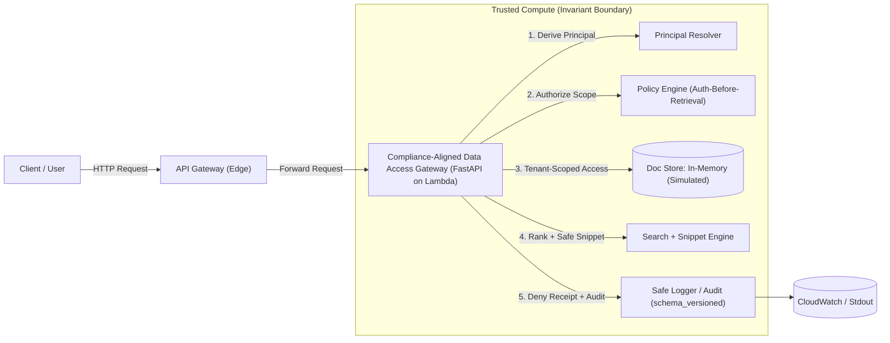

# Architecture

> Truth scope: accurate as of **v1.0.0**.

## Goal

A production-shaped, multi-tenant **data access gateway** that enables retrieval (including RAG-style “chat over docs”) while enforcing non-negotiable security invariants **inside** a strict trust boundary.

This project targets the most common failure mode in retrieval systems: **unauthorized retrieval** (admin leakage or cross-tenant leakage). The core idea is simple:

> If unauthorized text ever enters application memory (or an LLM context window), you can’t “unfetch” it.
> Therefore, authorization must happen **before** retrieval and before any snippet is produced.

For the authoritative list of enforced controls and linked evidence artifacts, see the **[Controls Catalog](./controls.md)**.

---

## Intended use (realistic)

This gateway is designed to be the **single choke point** for retrieval in a product:

- Teams building retrieval/RAG features call **this gateway** for retrieval + snippets instead of querying the store directly.
- The backing document store is treated as **passive**; all access control happens in the gateway.

### Concrete scenarios (what it prevents)

- **Intern in Tenant A** tries to retrieve **Tenant A admin runbook** → **blocked** + audit-grade deny receipt (`reason_code`, `request_id`).
- **Intern in Tenant A** tries to retrieve **Tenant B roadmap** → **blocked** + audit-grade deny receipt.

---

## High-level data flow & trust boundary

---

## Data layer (simulated)

* **Status:** In-memory (non-persistent).
* **Why:** To keep the demo zero-cost, portable, and reproducible, this reference implementation uses a thread-local in-memory store.
* **Production path:** In a real deployment, the `InMemoryStore` is swapped for a persistent store (e.g., DynamoDB, pgvector, Pinecone). The `list_scoped(...)` interface preserves the same security logic regardless of backing storage.

---

## Trust model

### What is attacker-controlled (untrusted)

* Request headers and body
* Query text
* Stored document text
* Any client-supplied claims or identifiers

### What is trusted (invariant boundary)

* Principal derivation
* Policy evaluation
* Tenant scoping
* Snippet redaction
* Audit logging (deny receipts)

---

## Identity source (local vs cloud)

* **Local dev:** Identity is mocked via headers (`X-User`, `X-Tenant`, `X-Role`) for deterministic demos and security gates. This mode is **fail-closed by default** unless explicitly enabled (`ALLOW_INSECURE_HEADERS=true`).
* **Cloud dev:** Identity is enforced at the edge by an **API Gateway JWT authorizer** backed by **Cognito**. Lambda only processes requests with valid, cryptographically signed claims, which are mapped into the same `Principal` model used locally.

---

## Retrieval model (intentional)

Retrieval is **lexical** (simple keyword scoring) **by design** (demo-scoped):

* The thesis of this project is the **security boundary** (auth-before-retrieval + tenant scoping + auditable denials), not embeddings quality.
* Lexical retrieval keeps demos and gates deterministic while exercising the same authorization, scoping, and snippet pathways a vector system would.

---

## Request flows

### Local request flow (deterministic)

* Identity is provided via headers: `X-User`, `X-Tenant`, `X-Role`.
* Middleware assigns a `request_id` and returns `X-Request-Id` (aliased as **X-Trace-Id** for client correlation).
* Authorization is evaluated before sensitive actions:

  * before ingestion writes
  * before query retrieval/snippet generation
* Storage access is tenant-scoped (structural isolation).
* Logging is structured JSON with deny receipts.

### Cloud dev slice (AWS)

Provisioned via Terraform:

* Lambda (Python 3.12, **x86_64**)
* API Gateway HTTP API
* Cognito user pool + client for JWT issuance
* CloudWatch log retention (7 days)
* CloudWatch alarms: 5xx errors, throttles, high denials
* Metric filter counts deny receipts from structured logs

---

## Client verification

* **Reference client:** `examples/reference-client/verify.py` treats the gateway as a black box.
* **Role:** Validates the “consumer contract” (service liveness, identity resolution, fail-closed policy) via real HTTP requests.

---

## Evidence & proof

* Evidence index: **[`evidence/INDEX.md`](../evidence/INDEX.md)**
* Controls → implementation → evidence mapping: **[`docs/controls.md`](./controls.md)**
* Executable proof commands are documented in **[Operations](./operations.md)**.
