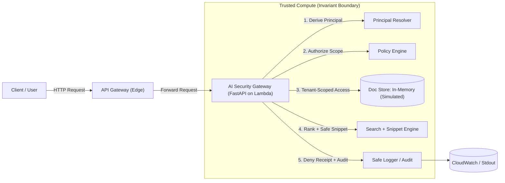

# Architecture

> Truth scope: accurate as of **v0.8.0**.

## Goal

A multi-tenant gateway that enables “AI-style retrieval” while enforcing non-negotiable security invariants **inside** a strict trust boundary.

This project targets the most common RAG failure mode: **unauthorized retrieval** (admin leakage or cross-tenant leakage). The core idea is simple:

> If unauthorized text ever enters retrieval/snippet generation, you can’t “unfetch” it.
> So authorization must happen **before** retrieval and before any snippet is produced.

---

## Intended use (realistic)

This gateway is designed to be the **single choke point** for retrieval in a product:

* Teams building RAG features call **this gateway** for retrieval/snippets instead of querying the store directly.
* The document store is treated as **passive**; all access control happens in the gateway.

### Concrete scenario (what it prevents)

* **Intern in Tenant A** tries to retrieve **Tenant A admin runbook** → **blocked** + deny receipt (`reason_code`, `request_id`).
* **Intern in Tenant A** tries to retrieve **Tenant B roadmap** → **blocked** + deny receipt.

---

## High-level data flow & trust boundary

## Data Layer (Simulated)

* **Status:** In-Memory (Non-Persistent).
* **Why:** To maintain a zero-cost, portable, and reproducible demo environment, this reference implementation uses a thread-local in-memory store.
* **Production Path:** In a real deployment, the `InMemoryStore` class is swapped for a persistent vector or document store (e.g., DynamoDB, Pinecone, pgvector). The `list_scoped` interface allows the security logic to remain identical regardless of the backing storage.

---

## Trust model

### What is attacker-controlled (untrusted)

* Request headers and body
* Query text
* Stored document text
* Any client-supplied claims

### What is trusted (invariant boundary)

* Principal derivation
* Policy evaluation
* Tenant scoping
* Snippet redaction
* Audit logging (deny receipts)

---

## Identity source (local vs cloud)

* **Local dev:** identity is mocked via headers (`X-User`, `X-Tenant`, `X-Role`) for deterministic demos and security gates.
* **Cloud dev:** identity is enforced at the edge by an **API Gateway JWT authorizer** backed by **Cognito**. Lambda only processes requests with valid, cryptographically signed claims, which are mapped into the same `Principal` model used locally.

---

## Security invariants (enforced by code + checked by `make gate`)

1. **Auth-Before-Retrieval:** permissions are applied to the retrieval scope (not filtered post-fetch).
2. **Strict Tenant Isolation:** tenant is derived server-side; storage reads/writes are tenant-scoped.
3. **No Admin Leakage:** non-admin roles must never retrieve admin-classified titles/snippets/bodies.
4. **Safe Logging:** logs must never contain raw request bodies/queries/auth headers/tokens.
5. **Evidence-over-Claims:** denials are traceable via `request_id` and backed by numbered evidence artifacts.
6. **No Secret Egress via Snippets:** snippet output is redacted to prevent leaking secrets even if they exist in stored docs.

---

## Retrieval model (intentional)

Retrieval is **lexical** (simple keyword scoring) **by design** (demo-scoped):

* The thesis of this project is the **security boundary** (auth-before-retrieval + tenant scoping + auditable denials), not embeddings.
* Lexical retrieval keeps demos and gates deterministic while still exercising the same authorization, scoping, and snippet pathways a vector system would.

---

## Request flows

### Local request flow (deterministic)

* Identity is provided via headers: `X-User`, `X-Tenant`, `X-Role`.
* Middleware assigns a `request_id` and returns `X-Request-Id`.
* Authorization is evaluated before sensitive actions:
* before ingestion writes
* before query retrieval/snippet generation

* Storage access is tenant-scoped (structural isolation).
* Logging is structured JSON (“deny receipts”).

### Cloud dev slice (AWS)

Provisioned via Terraform:

* Lambda (Python 3.12)
* API Gateway HTTP API
* Cognito user pool + client for JWT issuance
* CloudWatch log retention (7 days)
* CloudWatch alarms: 5xx errors, throttles, high denials
* Metric filter counts deny receipts from structured logs

---

## Proof hooks

* `make gate` runs:
* `no_admin_leakage_gate`
* `tenant_isolation_gate`
* `safe_logging_gate`

Evidence is indexed in `evidence/INDEX.md`.

> If you only review one thing: the claims are executable (`make ci` / `make gate`) and supported by screenshots in `evidence/`.
