# Case Study: Preventing an Intern Attack (BOLA)

> **Scenario Type:** Broken Object-Level Authorization (OWASP API Security Top 10)

---

## 📋 Scenario

**Alex**, a summer intern at Blue Inc., discovers that the company's AI "Ask HR" chatbot uses a RAG (Retrieval-Augmented Generation) system to answer employee questions.

Curious about executive compensation, she wonders: *Can I trick the system into revealing the CEO's salary?*

---

## 🎯 Attack Vector

Alex crafts a seemingly innocent query:

```
"What are the compensation benchmarks for senior leadership positions?"
```

She sends this to the chatbot, hoping the semantic similarity will retrieve executive pay documents.

---

## ❌ Without the Security Gateway (Unprotected RAG)

```mermaid
sequenceDiagram
    actor Alex as Alex (Intern)
    participant Chat as AI Chatbot
    participant Vector as Vector Store
    participant LLM as LLM

    Alex->>Chat: "compensation benchmarks for leadership"
    Chat->>Vector: Semantic search (no auth check)
    Vector-->>Chat: [CEO_Payroll_2025.pdf, Exec_Bonus_Structure.pdf]
    Chat->>LLM: Context: CEO salary = $2.4M + bonus...
    LLM-->>Chat: "Based on our data, CEO compensation is..."
    Chat-->>Alex: 💥 LEAK: Full executive compensation details
```



**What went wrong:**
1. Query reaches the vector store **without scope filtering**
2. Semantic search returns "closest match" (CEO payroll doc is highly relevant)
3. Document (classification: `admin`) is fetched and sent to LLM
4. LLM incorporates the leaked data into its response
5. **Alex now knows the CEO makes $2.4M** - data breach complete

---

## ✅ With the AI Security Gateway


**What happened:**
1. Alex's JWT is validated → Principal derived: `{role: "intern"}`
2. Policy engine calculates scope: **interns can only see `public` docs**
3. Store query is **pre-scoped** - admin docs are never even searched
4. Zero results returned (no public docs about executive compensation)
5. Audit log records the attempt with `request_id` for forensics

---

## 📊 Comparison

| Aspect | Unprotected RAG | With Security Gateway |
|--------|-----------------|----------------------|
| **Authorization** | None (semantic search is identity-blind) | Per-request, role-based |
| **When auth happens** | Never | **Before** retrieval |
| **Admin docs visible** | Yes (if semantically relevant) | No (filtered from scope) |
| **Audit trail** | None | Full forensic receipt |
| **Blast radius** | Entire document corpus | Only permitted classifications |

---

## 🔒 Business Impact Prevented

| Risk | Status |
|------|--------|
| **Data Breach** | ✅ Prevented - admin docs never fetched |
| **Compliance Violation** | ✅ Avoided - GDPR/SOC2 controls enforced |
| **Reputational Damage** | ✅ Mitigated - no leak to report |
| **Legal Liability** | ✅ Reduced - audit trail proves due diligence |

---

## 🧪 Try It Yourself

**1. Start the gateway:**
```bash
make run-local
```

**2. Seed an admin document:**
```bash
curl -X POST http://127.0.0.1:8000/ingest \
  -H 'Content-Type: application/json' \
  -H 'X-User: admin' -H 'X-Tenant: blue' -H 'X-Role: admin' \
  -d '{"title": "CEO Compensation 2025", "body": "CEO salary is 2.4M with 500K bonus", "classification": "admin"}'
```

**3. Attack as intern:**
```bash
curl -X POST http://127.0.0.1:8000/query \
  -H 'Content-Type: application/json' \
  -H 'X-User: alex' -H 'X-Tenant: blue' -H 'X-Role: intern' \
  -d '{"query": "compensation"}'
```

**4. Result:**
```json
{
  "results": [],
  "request_id": "a1b2c3d4-..."
}
```

The admin document is **invisible** to Alex. The gateway logs show:
```json
{
  "event": "query_allowed",
  "user_id": "Alex",
  "role": "intern",
  "results_count": 0,
  "request_id": "a1b2c3d4-..."
}
```

---

## 📚 Related Documentation

- [Threat Model](threat_model.md) - Full threat analysis including this scenario (T2)
- [Architecture](architecture.md) - How the security boundary is implemented
- [Evidence Index](../evidence/INDEX.md) - Screenshots proving the invariants hold
