# Case Study: Preventing an Intern Retrieval Leak (BOLA)

> **Scenario type:** Broken Object-Level Authorization (OWASP API Security Top 10)

---

## 📋 Scenario

**Alex**, a summer intern at Blue Inc., discovers that the company’s “Ask HR” feature uses retrieval (RAG-style “chat over docs”) to answer employee questions.

Curious about executive compensation, she wonders:

> Can I get the system to retrieve admin-classified documents I’m not authorized to see?

---

## 🎯 Attack vector

Alex crafts a seemingly harmless query:

```

"What are the compensation benchmarks for senior leadership positions?"

```

She hopes semantic similarity will retrieve executive pay documents.
This is **not** a “prompt injection” problem - it’s a **retrieval authorization** problem.

---

## ❌ Without the gateway (fetch-then-filter / identity-blind retrieval)

```mermaid
sequenceDiagram
    actor Alex as Alex (Intern)
    participant App as Chat/RAG App
    participant Store as Retrieval Store (Vector/Docs)
    participant LLM as LLM

    Alex->>App: "compensation benchmarks for leadership"
    App->>Store: Search (no scope enforcement)
    Store-->>App: [CEO_Payroll_2025.pdf, Exec_Bonus_Structure.pdf]
    App->>LLM: Context includes admin-classified content
    LLM-->>App: "Based on our data, CEO compensation is..."
    App-->>Alex: 💥 LEAK: executive compensation details
```



**What went wrong:**

1. The query reaches retrieval **without scope enforcement**
2. Search returns the “closest match” (admin-classified payroll docs are highly relevant)
3. Unauthorized documents are fetched into application memory (or LLM context)
4. The model outputs the leaked information
5. The organization has a disclosure incident - and may have no defensible audit trail

---

## ✅ With the Compliance-Aligned Data Access Gateway (Auth-Before-Retrieval)

```mermaid
sequenceDiagram
    actor Alex as Alex (Intern)
    participant GW as Data Access Gateway
    participant Policy as Policy Engine
    participant Store as Tenant-Scoped Store
    participant Audit as Audit Log

    Alex->>GW: POST /query {"query": "compensation benchmarks"}

    rect rgb(40, 80, 40)
        Note over GW,Policy: 🛡️ TRUSTED COMPUTE BOUNDARY
        GW->>GW: Resolve Principal (JWT or fail-closed local mode)
        Note right of GW: {user_id:"alex", role:"intern", tenant_id:"blue"}
        GW->>Policy: Calculate allowed scope
        Policy-->>GW: allowed_classifications=["public"]
    end

    GW->>Store: list_scoped(tenant=blue, classifications=["public"])
    Store-->>GW: [] (no permitted docs match)

    GW->>Audit: Log query_allowed (0 results, request_id)
    GW-->>Alex: {"results": [], "request_id": "abc123"}
```



**What happened:**

1. Identity is verified → principal derived (`role="intern"`)
2. Policy engine computes allowed scope (interns → `public`)
3. Retrieval is **pre-scoped** - admin docs are never even searched
4. Zero results returned (no permitted docs match)
5. The attempt is traceable via structured logs (`request_id`)

---

## 📊 Comparison

| Aspect                 | Unprotected retrieval   | With gateway                                |
| ---------------------- | ----------------------- | ------------------------------------------- |
| **Authorization**      | None (identity-blind)   | Per-request, role-based                     |
| **When auth happens**  | Never / after-the-fact  | **Before** retrieval                        |
| **Admin docs visible** | Yes (if relevant)       | No (out of scope)                           |
| **Audit trail**        | Often missing / partial | Audit-grade deny receipts + correlation IDs |
| **Blast radius**       | Entire corpus           | Only permitted classifications              |

---

## 🔒 Business impact prevented

| Risk                                | Status                                                            |
| ----------------------------------- | ----------------------------------------------------------------- |
| **Unauthorized disclosure**         | ✅ Prevented - admin docs never fetched for intern scope           |
| **Policy violation (need-to-know)** | ✅ Reduced risk - access is enforced at retrieval time             |
| **Reputational damage**             | ✅ Mitigated - no leak to report                                   |
| **Forensic uncertainty**            | ✅ Improved - structured logs enable investigation by `request_id` |

> **Truth scope note:** This is a reference implementation demonstrating technical controls and evidence generation. It does not claim compliance certification.

---

## 🧪 Try it yourself (local)

**1) Start the gateway**

```bash
make run-local
```

**2) Seed an admin document (as admin)**

```bash
curl -i -X POST http://127.0.0.1:8000/ingest \
  -H 'Content-Type: application/json' \
  -H 'X-User: admin' -H 'X-Tenant: blue' -H 'X-Role: admin' \
  -d '{"title":"CEO Compensation 2025","body":"CEO salary is 2.4M with 500K bonus","classification":"admin"}'
```

**3) Attempt retrieval as intern**

```bash
curl -i -X POST http://127.0.0.1:8000/query \
  -H 'Content-Type: application/json' \
  -H 'X-User: alex' -H 'X-Tenant: blue' -H 'X-Role: intern' \
  -d '{"query":"compensation"}'
```

**4) Result (expected)**

```json
{
  "results": [],
  "request_id": "a1b2c3d4-..."
}
```

The admin document is **invisible** to Alex because retrieval is pre-scoped.

Example structured audit event:

```json
{
  "event": "query_allowed",
  "tenant_id": "blue",
  "role": "intern",
  "results_count": 0,
  "request_id": "a1b2c3d4-...",
  "schema_version": "1.0"
}
```

---

## 📚 Related documentation

* [Threat Model](threat_model.md) - full threat analysis including this scenario
* [Architecture](architecture.md) - how the trust boundary and invariants are implemented
* [Controls Catalog](controls.md) - controls → implementation → evidence mapping
* [Evidence Index](../evidence/INDEX.md) - screenshot proofs that gates and invariants hold
